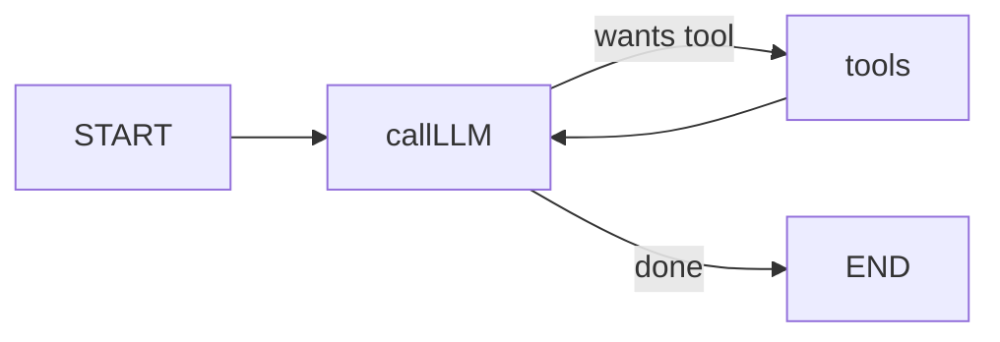

# Module 1 - LangGraph

**Time:** ~4 hours. **Install:** `pip install -e ".[langgraph]"` from the
course root.

LangGraph is a library for building agents as **explicit state machines**.
Where other frameworks hide the control flow, LangGraph makes it a first-class
object: nodes, edges, conditional routing, checkpoints. This is the framework
to reach for when you want:

- Deterministic, inspectable control flow
- Human-in-the-loop approval pauses (via `interrupt()`)
- Durable state across runs (via checkpointers)
- Complex branching that a pure ReAct loop can't express cleanly

## Mental model

A LangGraph agent is a directed graph where:

- **Nodes** are Python functions that take the current `State` and return an
  update to it.
- **Edges** are transitions. They can be unconditional (`A -> B`) or
  **conditional** (a function that looks at the state and returns the name of
  the next node).
- **State** is a typed dict, reduced over time by the node updates.

That diagram is literally the `create_react_agent` pattern - a two-node graph
with a conditional edge. Module 1 builds this up from scratch in L1, adds HITL
in L2, and adds durable memory in L3.

## Lessons

1. **[`lesson_1_graph_basics.py`](lesson_1_graph_basics.py)** - build the
   classic "LLM + tool loop" graph by hand with `StateGraph`.
2. **[`lesson_2_tools_hitl.py`](lesson_2_tools_hitl.py)** - add human approval
   before sending email using `interrupt()` + checkpointers.
3. **[`lesson_3_memory.py`](lesson_3_memory.py)** - thread-scoped short-term
   memory (checkpointer) and cross-thread long-term memory (`InMemoryStore`).

Then the mini-project:

4. **[`project_workflow_v1.py`](project_workflow_v1.py)** - Personal Ops
   Assistant built entirely in LangGraph. Triage inbox, check calendar, pull
   CRM context, draft reply, pause for approval, send.

Finish with the **[exercises](exercises.md)**. Solutions live in
[`solutions/`](solutions/).

## Why this order

L1 gives you the vocabulary. L2 introduces the pattern you'll use in every real
deployment (HITL). L3 solves the "my agent forgot me" problem that bites every
production system. The project composes all three.

## Checklist before moving on

- [ ] You can draw the graph for `lesson_1_graph_basics.py` on a whiteboard.
- [ ] You understand the difference between a checkpointer (short-term, per
      thread) and a store (long-term, cross-thread).
- [ ] `project_workflow_v1.py` runs, drafts a reply, pauses, and sends only
      after you type `y`.
