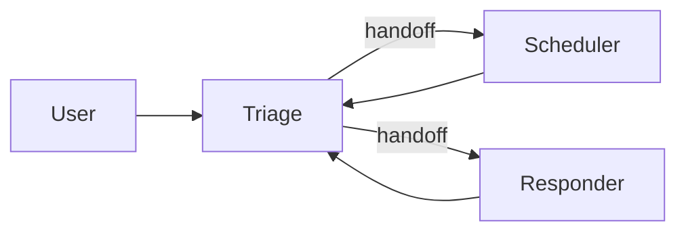

# Module 2 - OpenAI Agents SDK

**Time:** ~3 hours. **Install:** `pip install -e ".[openai-agents]"` from the
course root.

The OpenAI Agents SDK (`openai-agents`) is a deliberately **small** library:
an `Agent`, `Tools`, a `Runner`, `Handoffs`, and `Guardrails`. No state
machines, no DAGs. Where LangGraph makes the control flow explicit, Agents SDK
keeps it implicit and pushes the complexity into multiple specialist agents
that *hand off* to each other.

Reach for it when:

- You want the fastest path from idea to running agent (less boilerplate than
  LangGraph).
- Your use case fits the "one coordinator + several specialists" pattern.
- You want tracing in the OpenAI dashboard for free.

You usually won't reach for it when you need custom durable checkpointing or
complex cyclic control flow - LangGraph fits better there.

## Mental model

A **handoff** is "let the next agent take over the rest of the conversation" -
the SDK ships it as a tool under the hood, but the ergonomics feel like a
clean delegation.

## Lessons

1. **[`lesson_1_agents_tools.py`](lesson_1_agents_tools.py)** - `Agent`,
   `@function_tool`, `Runner.run_sync`, streaming.
2. **[`lesson_2_handoffs_guardrails.py`](lesson_2_handoffs_guardrails.py)** -
   agent-to-agent handoffs and input guardrails.

Project:

3. **[`project_workflow_v2.py`](project_workflow_v2.py)** - same workflow as
   Module 1 but with a `TriageAgent` that hands off to `SchedulerAgent` or
   `ResponderAgent`.

Then the **[exercises](exercises.md)**.

## Tracing note

The SDK automatically traces every run to the OpenAI dashboard
(platform.openai.com/logs) as long as your `OPENAI_API_KEY` has tracing
enabled (on by default). Open it while lessons run - it's the cleanest trace
viewer of the three frameworks.

## Checklist

- [ ] You can explain how handoffs differ from tool calls.
- [ ] You have opened a trace in platform.openai.com and walked through the
      spans.
- [ ] `project_workflow_v2.py` runs end-to-end with at least one handoff.
