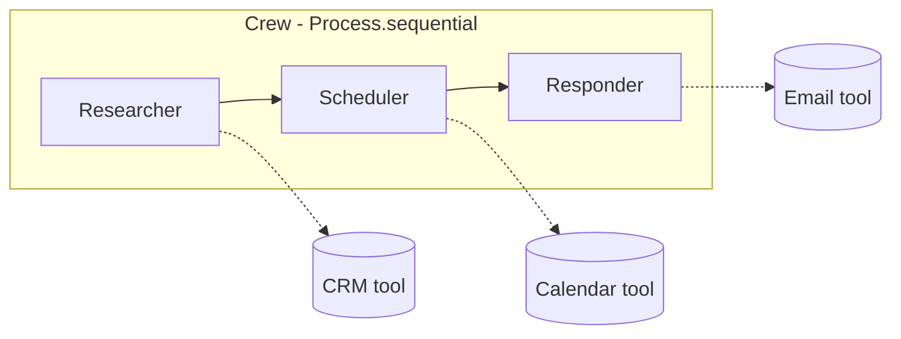

# Module 3 - CrewAI

**Time:** ~3 hours. **Install:** `pip install -e ".[crewai]"` from the
course root.

CrewAI models agents as **teammates with roles**. You declare:

- **Agents**: `role`, `goal`, `backstory`, `tools`.
- **Tasks**: natural-language instructions with an `expected_output`, each
  assigned to an agent.
- A **Crew** that runs tasks either `Process.sequential` (one after another,
  each seeing the previous output) or `Process.hierarchical` (a manager LLM
  dispatches tasks and stitches results).

Reach for CrewAI when the work **naturally decomposes into distinct roles**
(Researcher -> Scheduler -> Responder) and you want the ceremony of agent
interaction to feel like a team meeting rather than a state machine.

## Mental model

Each box above is an Agent with its own instructions and tools.

## Lessons

1. **[`lesson_1_crews_tasks.py`](lesson_1_crews_tasks.py)** - build a two-agent
   sequential crew, then switch to hierarchical and observe the difference.
2. **[`lesson_2_tools_memory.py`](lesson_2_tools_memory.py)** - custom `BaseTool`
   subclasses wrapping our mock APIs + enabling memory on a crew.

Project:

3. **[`project_workflow_v3.py`](project_workflow_v3.py)** - 3-agent crew
   (Researcher / Scheduler / Responder) over the same inbox+calendar+CRM
   scenario, with a Python-side approval step before sending.

Finish with **[exercises](exercises.md)**.

## Checklist

- [ ] You can explain when `sequential` beats `hierarchical` and vice versa.
- [ ] You built one custom `BaseTool` that calls one of the mock APIs.
- [ ] `project_workflow_v3.py` produces at least one draft you can approve.
